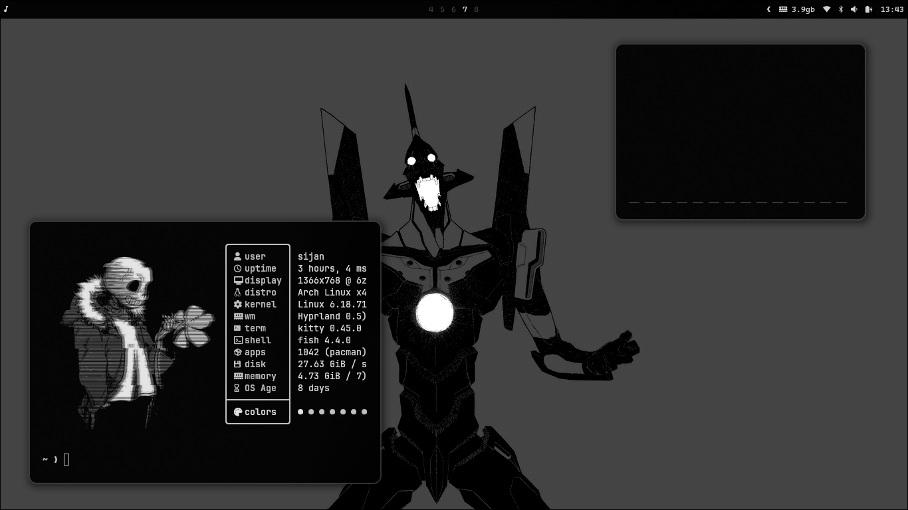
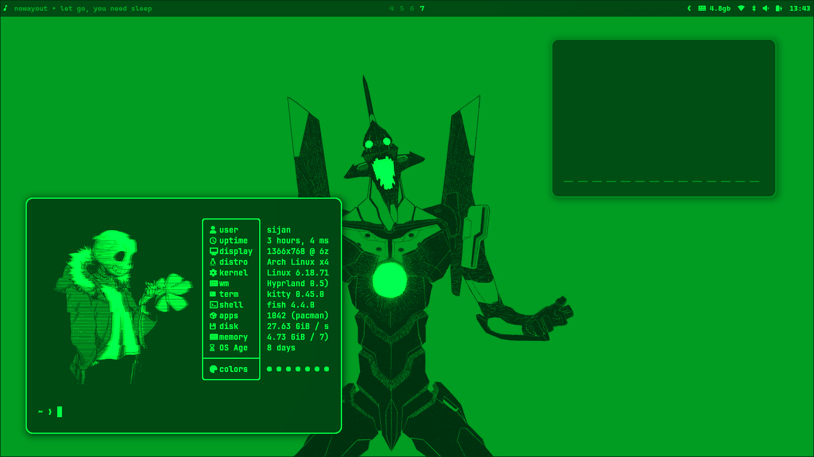
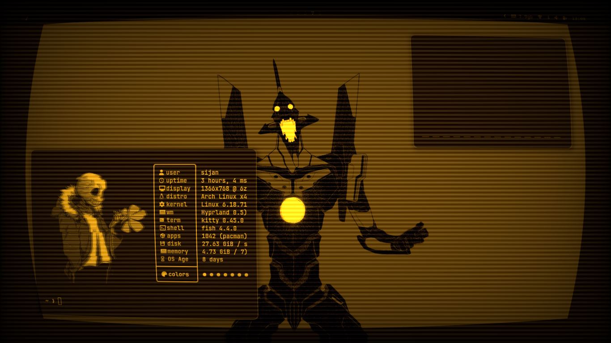
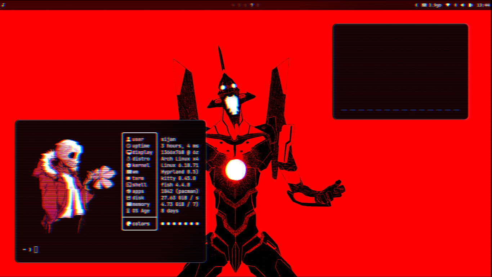

# HyprShades

A collection of screen shaders for Hyprland window manager to customize your display with various visual effects.

## 📦 Available Shaders

### Display & Eye Comfort

- **blue-light-filter.glsl** - Reduces blue light emission for evening use and eye strain reduction

- **amoled.glsl** - AMOLED black with monochrome effect for battery saving on OLED displays

  

### Retro & Terminal Effects

- **matrix.glsl** - Classic Matrix green terminal with phosphor glow

  

- **retro.glsl** - Vintage CRT monitor effect with scanlines, vignette, and screen curvature (Amber/Green/White phosphor options)

  

### Creative Effects

- **cyberpunk.glsl** - Neon color grading with chromatic aberration and glow effects

  

## 🚀 Setup

### Prerequisites

- Hyprland window manager
- OpenGL ES 3.0+ support
- **hyprshade** - Shader manager for Hyprland ([installation guide](https://github.com/loqusion/hyprshade))

Install hyprshade:

```bash
# Using pip
pip install hyprshade

# Or using yay (AUR)
yay -S hyprshade
```

### Installation

Clone this repository to your Hyprland shaders directory:

```bash
git clone https://www.github.com/Sijan-BHusal/HyprShades.git ~/.config/hypr/shaders
```

Or manually copy the shader files:

```bash
mkdir -p ~/.config/hypr/shaders
cd ~/.config/hypr/shaders
# copy all .glsl files here
```

## 🎮 Usage

### Method 1: Manual Toggle with Keybindings

Add keybindings to your `~/.config/hypr/hyprland.conf` for quick shader toggling:

```conf
# Shader toggle keybindings
bind = $mainMod SHIFT, F1, exec, hyprshade toggle blue-light-filter
bind = $mainMod SHIFT, F2, exec, hyprshade toggle matrix
bind = $mainMod SHIFT, F3, exec, hyprshade toggle cyberpunk
bind = $mainMod SHIFT, F4, exec, hyprshade toggle retro
bind = $mainMod SHIFT, F5, exec, hyprshade toggle amoled

# Turn off any active shader
bind = $mainMod SHIFT, F12, exec, hyprshade off
```

Replace `$mainMod` with your modifier key (usually SUPER/Windows key).

**Usage**: Press the keybinding once to enable the shader, press again to disable it.

## ⚙️ Customization

Each shader has adjustable parameters at the top in the `CONFIGURATION` section. Edit the `.glsl` files to customize:

### blue-light-filter.glsl

```glsl
const float WARMTH = 0.7;      // 0.0 = no filter, 1.0 = maximum warmth
const float INTENSITY = 0.85;   // Overall brightness
```

### matrix.glsl

```glsl
const float BRIGHTNESS_BOOST = 1.3;  // Adjust brightness
const float CONTRAST = 1.4;          // Adjust contrast
const float PHOSPHOR_GLOW = 0.1;     // Glow intensity
```

### cyberpunk.glsl

```glsl
const float CHROMATIC_ABERRATION = 0.002;  // RGB split strength
const float SATURATION_BOOST = 1.5;        // Color vibrancy
const float GLOW_INTENSITY = 0.15;         // Bright area glow
```

### retro.glsl

```glsl
const int PHOSPHOR_TYPE = 1;  // 1=Amber, 2=Green, 3=White
const float SCANLINE_INTENSITY = 0.08;
const float VIGNETTE_STRENGTH = 0.3;
```

### amoled.glsl

```glsl
const float BLACK_THRESHOLD = 0.02;  // Pure black threshold
const float CONTRAST = 1.2;          // Contrast level
const float DESATURATION = 1.0;      // Monochrome strength
```

After editing a shader, reload it:

```bash
hyprshade off
hyprshade toggle shader-name
```

## 🤝 Contributing

Feel free to:

- Create new shaders
- Improve existing ones
- Report issues
- Share your configurations

## 💡 Tips

- **Battery Saving**: Use `hyprshade toggle amoled` on OLED laptops to reduce power consumption
- **Eye Strain**: Gradually increase blue-light-filter warmth in the evening
- **Screenshots**: Run `hyprshade off` before taking screenshots (shaders affect the entire screen)
- **Gaming**: Disable shaders with `hyprshade off` for color-accurate gaming
- **Multiple Monitors**: Shaders apply to all monitors (Hyprland limitation)
- **Quick Check**: Run `hyprshade current` to see which shader is active

## 🔗 Related Projects

- [Hyprland](https://hyprland.org/) - Dynamic tiling Wayland compositor
- [hyprshade](https://github.com/loqusion/hyprshade) - Advanced shader manager for Hyprland

---

**Note**: Shaders use GLSL ES 3.0. If you have issues, check your GPU drivers and OpenGL support.
